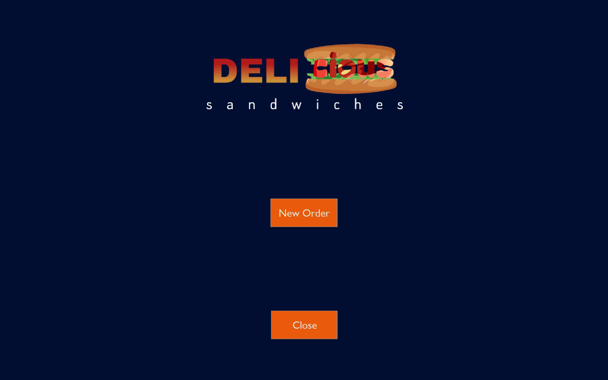
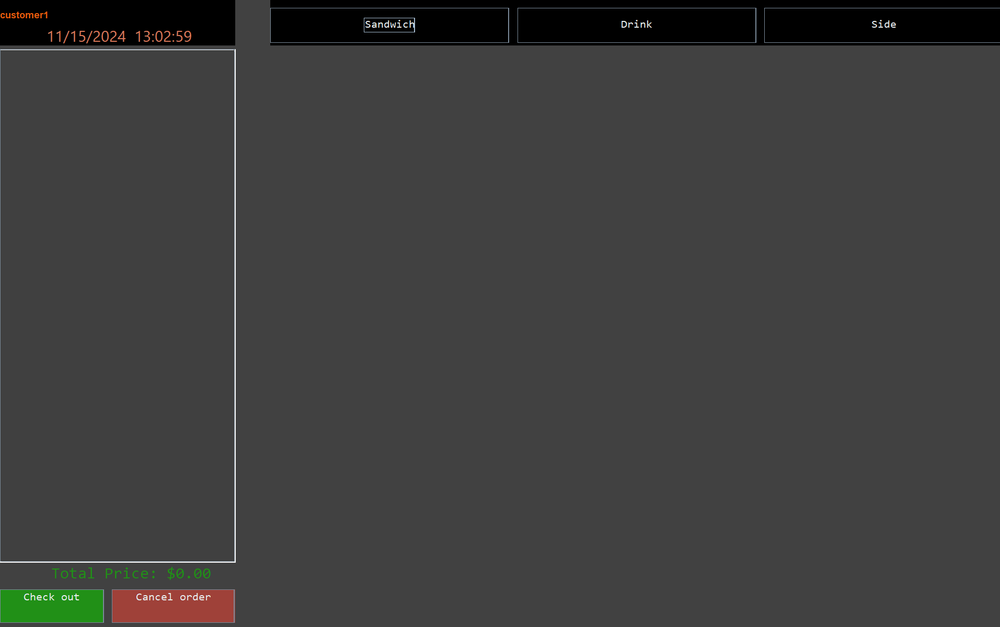
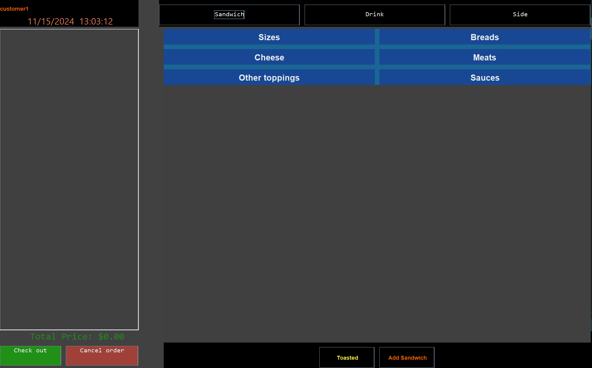
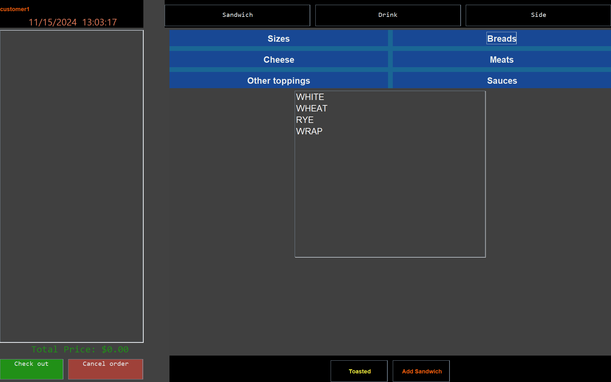
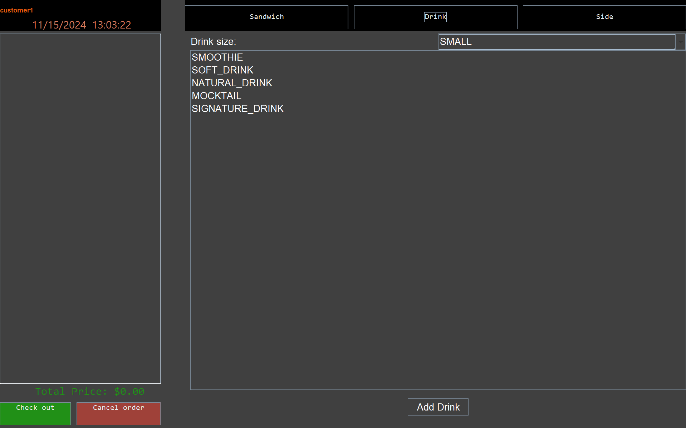
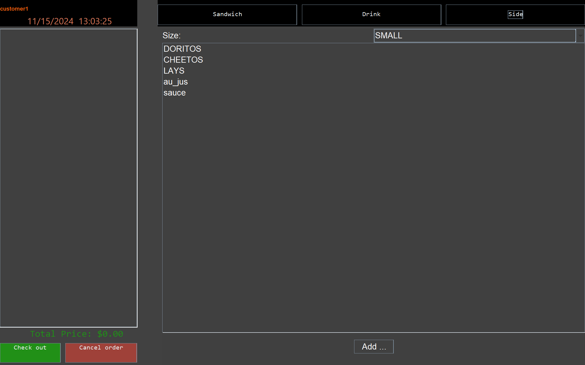
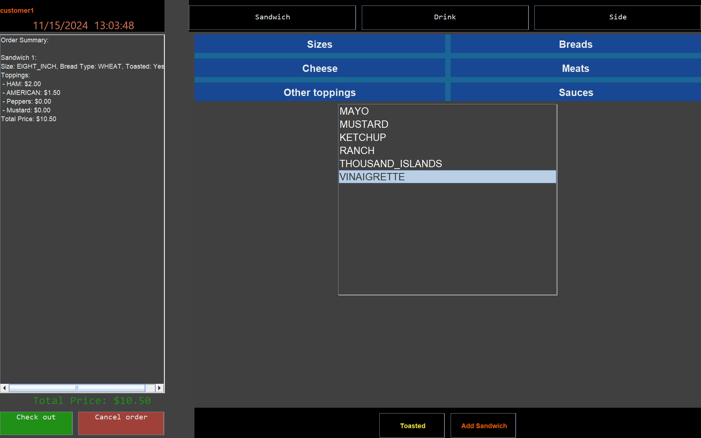
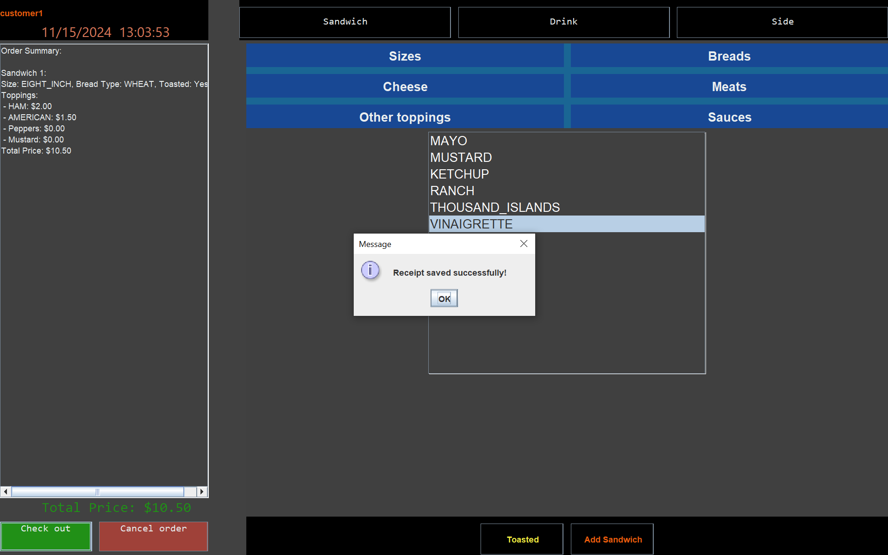

### Capstone Project 2

# Deli-cious POS System 

#### Student: Deiber Villalobos

#### Multisite App Dev - Year Up United

## Description
The Deli-cious POS System is a Point of Sale (POS) application designed for a sandwich shop that enables employees to manage customer orders efficiently. The system provides an easy-to-use interface to select sandwiches, drinks, and sides, as well as customize order preferences. It includes features such as order summary, order customization, and checkout.

## Key Features
#### User-Friendly Interfaces:
- **Home Screen**: A welcoming interface to initiate the order process.
- **Order Screen**: Provides access to menus for customizing orders.
- **Sandwich Screen**: Allows detailed customization of sandwiches, including bread type, toppings, and sauces.
-  **Drink Screen**: Choose beverages to complement meals.
-  **Side Screen**: Select sides such as chips or desserts.
-  **Order Summary Screen**: Displays a comprehensive breakdown of selected items.
-  **Checkout Screen**: Processes the order and calculates the total.

#### Functional Highlights:
- Dynamic real-time updates to order summaries and pricing.
-  Interactive panels for selecting sandwich size, bread type, and custom toppings.
-  Toasting option for sandwiches.
-  Save receipts for completed orders.
-  Allows employees to cancel and restart orders effortlessly.

## Technologies Used
- **Programming Language**: Java
- **GUI Framework**: Java Swing for interactive user interfaces.
- **File I/O**: For data persistence and receipt generation.
- Maven (build automation tool)

## Setup and Usage Instructions

**Prerequisites**
- Java Development Kit (JDK) version 11 or higher.
- Maven installed on your system.

**Installation**
1. Clone the repository:
   - git clone https://github.com/DeibCR/DELIcious.git
   
2. Navigate to the project directory:
   - cd DELIcious 
3. Build the project using Maven:
    - mvn clean install
4. Run the application:
   
   

## Usage

## System Architecture
**Key Components:**
1. **GUI Layer**: Provides the interface for users to interact with the system.
2. **Model Layer**: Manages the business logic and data structures, including Order, Sandwich, and Receipt classes.
3. **Integration**: File I/O for receipt management ensures transaction data is saved persistently.

## Future Enhancements
- **Integration with payment gateways** for credit/debit card transactions.
- **Support for multi-language interfaces** to cater to diverse audiences.
- **Database integration** for scalable data storage and retrieval.
- **Online ordering capabilities** to support remote orders.

## Additional Information:
This project was developed as part of the Multisite App Development program at Year Up United, where we aimed to design and implement a fully functional POS system tailored to a food service business. The application is built with Java swing, which provide a smooth and responsive user experience.

## Acknowledgments
Special thanks to **Year Up United** for providing the opportunity to develop this project and for supporting the learning journey.

## Contact Information
- Developer: **Deiber Villalobos**
- Email: **deibcr@gmail.com**
- GitHub: **Deibcr**
- Linkedin: **www.linkedin.com/in/deibcr**